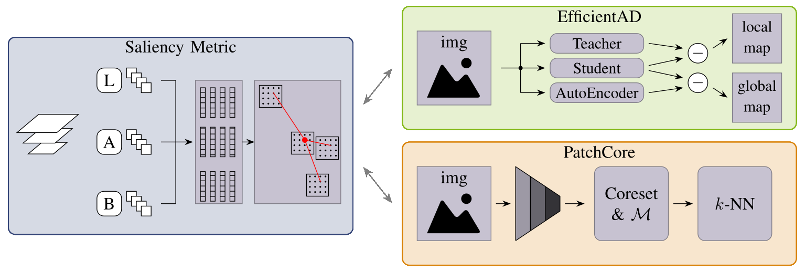

<a name="readme-top"></a>

<!-- PROJECT SHIELDS -->
<!--
*** I'm using markdown "reference style" links for readability.
*** Reference links are enclosed in brackets [ ] instead of parentheses ( ).
*** See the bottom of this document for the declaration of the reference variables
*** for contributors-url, forks-url, etc. This is an optional, concise syntax you may use.
*** https://www.markdownguide.org/basic-syntax/#reference-style-links
-->


<!-- PROJECT LOGO -->
<br />
<div align="center">
  <a href="https://github.com/technictoms/localization-of-wooden-defects">
    
  </a>

  <h3 align="center">Localization and Classification of Defects on Natural Wood Surfaces</h3>

  <p align="center">
    Associated GitHub repository for the paper.
    <br />
    <a href="https://github.com/technictoms/"><strong>Jump start »</strong></a>
    <br />
    <br />
    <a href="https://github.com/technictoms/">View Results</a>
    ·
    <a href="https://github.com/technictoms/localization-of-wooden-defects/issues">Report Bug</a>
    ·
    <a href="https://github.com/technictoms/localization-of-wooden-defects/issues">Ask a question</a>
  </p>
</div>


<!-- TABLE OF CONTENTS -->
<details>
  <summary>Table of Contents</summary>
  <ol>
    <li>
      <a href="#getting-started">Getting Started</a>
      <ul>
        <li><a href="#prerequisites">Prerequisites</a></li>
        <li><a href="#installation">Installation</a></li>
        <li><a href="#used-datasets">Used Datasets</a></li>
      </ul>
    </li>
    <li><a href="#usage">Usage</a></li>
    <li><a href="#results">Results</a></li>
    <li><a href="#contact">Contact</a></li>
    <li><a href="#license">License</a></li>
    <li><a href="#cite">Cite</a></li>
  </ol>
</details>


<!-- ABOUT THE PROJECT -->
## Getting started
Start by downloading this repo and then follow the steps for prerequisites and installation.

### Prerequisites
As a prerequisite to run this code it needs a running Python 3.xx environment. Furthermore, the following packages are used by the scripts, which can also be loaded via the requirements file:
- **torch**
- **torchvision**
- **torchmetrics**
- tqdm
- matplotlib
- sklearn
- faiss
- opencv
- numpy

### Installation

To carry out the experiments successfully, the following steps have to be performed:

1. Clone the repo
   ```sh
   git clone https://github.com/technictoms/localization-of-wooden-defects.git
   ```
2. Install all required packages
   ```sh
   pip install -r requirements.txt
   ```
3. Download all necessary datasets (NaturalOak & ImageNet)
4. Configure the Paths: In each Python file, change the global Path values to direct to the corresponding dataset. (``DATA_ROOT`` & ``DATA_ROOT_IMGNET``)
5. Run Pretraining for teacher network (optional if checkpoints available)
    ```sh
    python3 01-pretraining.py
    ```

<p align="right">(<a href="#readme-top">back to top</a>)</p>

### Used Datasets
This repository utilizes the datasets "NaturalOak" and "ImageNet", which can be downloaded via the provided links.

|  Dataset:    | Link:                 |
|--------------|-----------------------|
| NaturalOak   | [NaturalOak](https://doi.org/10.5281/zenodo.10245845)|
| ImageNet     | [ImageNet@Kaggle](https://www.kaggle.com/competitions/imagenet-object-localization-challenge)|

<p align="right">(<a href="#readme-top">back to top</a>)</p>

<!-- USAGE EXAMPLES -->
## Usage
The execution details for the individual scripts are listed below.

#### ``00-createSaliencyMaps.py``
This script is not needed to reproduce the experiments, since the dataset is already distributed with the computed saliency maps. However, it is included here to demonstrate how the saliency maps were generated. 

Each category is executed independently, meaning the script must be run separately for each image folder. Upon execution, the script generates a "Prior" subfolder within the respective folder where it saves matching saliency maps. 

#### ``01-pretraining.py``
This Python script pre-trains the teacher on the ImageNet dataset. To execute successfully, adjust the ``DATA_ROOT`` variable to point to the locally stored ImageNet dataset.

**Note**: If the checkpoints are available (folder: checkpoints) then the execution of this script is not necessary.

#### ``02-trainEfficientAD.py``
To replicate the outcomes of the EfficientAD algorithm, execute this script. Similar to the above cases, the two dataset variables (ImageNet & NaturalOak) need to be adjusted. 

In the execution section (``if __name__ == "__main__"``), you can select the size of the network to be trained (either M or S) and the number of iterations to be used.

#### ``03-evaluateOnlyPrior.py``
As with previous cases, the path to the dataset has to be adjusted and the script has to be executed. Subsequently, this script will load the previously computed saliency maps and evaluate them. 

#### ``04-trainPatchCore.py``
Finally, the PatchCore method can be evaluated. To evaluate, follow the instructions given in the preceding scripts: Adjust the data path and execute. Like the other scripts, all the outcomes are stored in the *results* folder (in ``.json`` files). 

<p align="right">(<a href="#readme-top">back to top</a>)</p>

## Results
As stated above, the results can be accessed through the Results folder. They are presented in the following table: 

|   |   | BinaryAUC: | Accuracy: | Precision: | Recall:  | pixelAUC:  | RDR:  |
|---|---|------------|-----------|------------|----------|------------|-------|  
| w/o Prior | EfficientAD Small | $0.8012$ | $0.80$ |$0.\overline{6}$|$0.5833$|$0.6523$|$0.1990$|
| | EfficientAD Medium | $0.7944$ |$0.8235$ |$0.\overline{6}$|$0.75$|$0.6678$|$0.2399$|
| | PatchCore |$\mathbf{0.9214}$ |$0.8588$ |$0.7308$ |$0.7916$|$0.7139$ |$0.1038$|
|||||||||  
|w/ Prior | EfficientAD Small |$0.9010$ |$\mathbf{0.8941}$ |$\mathbf{0.8261}$ |$0.7916$|$0.6785$|$0.2949$|
| | EfficientAD Medium |$0.8832$ | $0.8588$ | $0.7308$ | $0.7916$ | $0.7020$ | $0.2651$ |
| | PatchCore          |$0.9153$ | $0.8941$ | $0.8$    | $\mathbf{0.8333}$|$0.7060$ | $0.0339$ |
|||||||||  
| Reference |Salience Metric | $0.8627$ | $0.8118$ | $0.\overline{6}$|$0.\overline{6}$|$\mathbf{0.7858}$|$\mathbf{0.4357}$ |

<!-- CONTACT -->
## Contact

Project Link: [https://github.com/technictoms/localization-of-wooden-defects](https://github.com/technictoms/localization-of-wooden-defects)

<p align="right">(<a href="#readme-top">back to top</a>)</p>

## License
<p xmlns:cc="http://creativecommons.org/ns#" >This work is licensed under <a href="http://creativecommons.org/licenses/by-nc/4.0/?ref=chooser-v1" target="_blank" rel="license noopener noreferrer" style="display:inline-block;">CC BY-NC 4.0</a> See `license` for more information.</p> 

## Cite
To give credits please cite the following publication: 
> T. Sander, C. Wöhler, **"Localization and Classification of Defects on Natural Wood Surfaces,"** 2024, in 25nd IEEE International Conference on Industrial Technology (ICIT). Vol. 1. IEEE.

<p align="right">(<a href="#readme-top">back to top</a>)</p>
